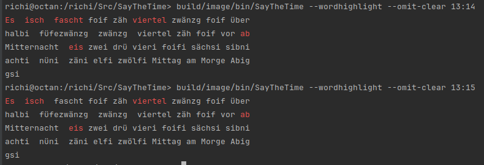
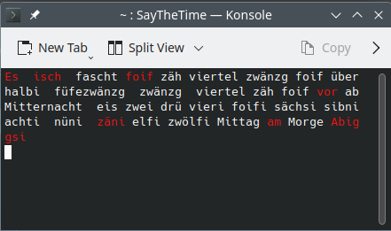

# SayTheTime

        <a href="https://github.com/richardeigenmann/SayTheTime"> 
</a> <a href="mailto:richard.eigenmann@gmail.com"> </a>

A small Java program that says the time in words in Swiss German or English on the command line. 
It took some inspiration from the Qlocktwo wall clock by Biegert & Funk (www.qlocktwo.com).
It can be used in conjunction with STDIN readers to do some fun things like having a cow say the time. 

It was built on modern `Java` using the `Gradle` build system and the `Java Module System`. Using `jlink` it
can be packaged into a small runtime image. The [picocli](https://picocli.info) library was used for the command line interface.

Please use this as a starting point for your owm Java Gradle Modularity projects or a text generator for
some cool application. 

Contributions, for instance more languages, are welcome.

Have Fun!

## What you can do with it

### Simplest use case: Output onto the Command Line

After installing the program, run it on the command line. 
It will output the current time. Here is a Linux BASH example:

```ignorelang
user@computer:~> /richi/Src/SayTheTime/build/image/bin/SayTheTime
Es isch fascht Mittag
```

Or specify the time to say:
```ignorelang
user@computer:~> /richi/Src/SayTheTime/build/image/bin/SayTheTime 13:15
Es isch viertel ab eis
```

If you don't understand Swiss German as spoken in Z&uuml;rich:
```ignorelang
user@computer:~> /richi/Src/SayTheTime/build/image/bin/SayTheTime --locale=en
It is almost quarter to eleven
```

### Use it with cowsay

On Linux you can install the program cowsay which puts the text you supply into
a comic style text buble. Here's how to let the cow say the time:

```ignorelang
user@computer:~> /richi/Src/SayTheTime/build/image/bin/SayTheTime 13:15 | cowsay
 ________________________ 
< Es isch viertel ab eis >
 ------------------------ 
        \   ^__^
         \  (oo)\_______
            (__)\       )\/\
                ||----w |
                ||     ||
```

Cowsay has many options. Check them with `man cowsay` For instance, to have a 
stoned cow say the time:

```ignorelang
user@computer:~> /richi/Src/SayTheTime/build/image/bin/SayTheTime 13:15 | cowsay -s
 ________________________ 
< Es isch viertel ab eis >
 ------------------------ 
        \   ^__^
         \  (**)\_______
            (__)\       )\/\
             U  ||----w |
                ||     ||
```

In the above examples I used the shells pipelining feature to send the Standard Output 
of the SayTheTime command to the next command (`cowsay`) as Standard Input. The pipe 
character (`|`) did that for us.

Alternatively we can also pass the time from `SayTheTime` as an argument to 
the `cowsay` program. We can ask the shell to run a command for us with the
`$()` syntax (or backtick, which I find less readable) and then take
the output of that command and pass it as an argument
to the `cowsay` program. Here with the ghostbusters 'cow':

```ignorelang
user@computer:~> cowsay -f ghostbusters $(/richi/Src/SayTheTime/build/image/bin/SayTheTime --locale=en 00:00)
  ________________ 
< It is midnight >
 ---------------- 
          \
           \
            \          __---__
                    _-       /--______
               __--( /     \ )XXXXXXXXXXX\v.
             .-XXX(   O   O  )XXXXXXXXXXXXXXX-
            /XXX(       U     )        XXXXXXX\
          /XXXXX(              )--_  XXXXXXXXXXX\
         /XXXXX/ (      O     )   XXXXXX   \XXXXX\
         XXXXX/   /            XXXXXX   \__ \XXXXX
         XXXXXX__/          XXXXXX         \__---->
 ---___  XXX__/          XXXXXX      \__         /
   \-  --__/   ___/\  XXXXXX            /  ___--/=
    \-\    ___/    XXXXXX              '--- XXXXXX
       \-\/XXX\ XXXXXX                      /XXXXX
         \XXXXXXXXX   \                    /XXXXX/
          \XXXXXX      >                 _/XXXXX/
            \XXXXX--__/              __-- XXXX/
             -XXXXXXXX---------------  XXXXXX-
                \XXXXXXXXXXXXXXXXXXXXXXXXXX/
                  ""VXXXXXXXXXXXXXXXXXXV""
```

### The Qlocktwo inspiration

Having admired the beautiful Qlocktwo wall clocks made by 
Biegert & Funk (www.qlocktwo.com ) I felt like doing something similar with words.

Side note: check out this cool TCL implementation of the Qlocktwo https://wiki.tcl-lang.org/page/QLOCKTWO+in+Tcl

#### Wordhighlight mode

If we had a "superphrase" that had all the words in the right order that 
are possible for the time phrases then we could show the words that make 
up the time in a highlight color and those that are not in the phrase in
a normal text color. Here an example for 13:14 and 13:15:



The SayTheTime command line program has some options that you can pass 
into the command that affect the output. The -h option shows all available
options:

```ignorelang
user@computer:~> /richi/Src/SayTheTime/build/image/bin/SayTheTime -h
sage: SayTheTime [-ahnorsVw] [-c=<wrapCol>] [--highlightcolor=<color>]
                  [--locale=<locale>] [<suppliedTime>]
Outputs the time in words on STDOUT
      [<suppliedTime>]       The time in 24h notation to say. I.e. 13:15
  -a, --all                  Show all time texts on STDOUT. Can be used in
                               combination with -w or --wordhighlight
  -c, --wrap-col=<wrapCol>   Which column to wrap at in wrap mode. Default is 50
  -h, --help                 Show this help message and exit.
      --highlightcolor=<color>
                             Highlight Color, if provided, must be one of: RED,
                               GREEN, BLUE, YELLOW, CYAN, PURPLE, WHITE.
                               Default is RED
      --locale=<locale>      Locale of the language to use, if provided, must
                               be one of: de_CHZH, en. Default is de_CHZH
  -n, --no-wrap              Do not wrap the lines
  -o, --no-clear             Do not clear the screen in wrap mode
  -r, --run                  Run forever and refresh every 10 seconds
  -s, --superphrase          Show superphrase. This is the union all merge of
                               all time phrases that are possible
  -V, --version              Print version information and exit.
  -w, --wordhighlight        Word highlight mode
```

If we turn on `-w` or `--wordhighlight` mode a few things happen:
- The superphrase is printed with the words highlighted. 
- The terminal screen is cleared so that the text prints at the top of the window.
- The text is wrapped and block adjusted to 50 columns

For the above example I added the `--no-clear` flag so that we can show 
two times underneath each other.

If we use the `--run` option we get a clock in the terminal window that 
refreshes itself every minute until you stop it with ctrl-c:

```bash
user@computer:~> `/richi/Src/SayTheTime/build/image/bin/SayTheTime --run --wordhighlight
```



#### Superphrase

To make this work we need a "superphrase". You can show the raw superphrase with the `--superphrase option:

```bash
user@computer:~> `/richi/Src/SayTheTime/build/image/bin/SayTheTime --superphrase
Es isch fascht foif zäh viertel zwänzg foif über halbi füfezwänzg zwänzg viertel zäh foif vor ab Mitternacht eis zwei drü vieri foifi sächsi sibni achti nüni zäni elfi zwölfi Mittag am Morge Abig gsi
```

But, how did this phrase come about? First we need to know all the possible time phrases
that we could encounter. The `--all` option gives us that:

```bash
user@computer:~> `/richi/Src/SayTheTime/build/image/bin/SayTheTime --all
Es isch Mitternacht
Es isch Mitternacht gsi
Es isch Mitternacht gsi
Es isch fascht foif ab Mitternacht
Es isch fascht foif ab Mitternacht
Es isch foif ab Mitternacht
Es isch foif ab Mitternacht gsi
[...]
Es isch fascht halbi elfi am Abig
Es isch halbi elfi am Abig
Es isch halbi elfi am Abig gsi
Es isch halbi elfi am Abig gsi
Es isch fascht foif über halbi elfi am Abig
Es isch fascht foif über halbi elfi am Abig
Es isch foif über halbi elfi am Abig
Es isch foif über halbi elfi am Abig gsi
[...]
Es isch foif vor zwölfi am Abig
Es isch foif vor zwölfi am Abig gsi
Es isch foif vor zwölfi am Abig gsi
Es isch fascht Mitternacht
Es isch fascht Mitternacht
```

To come up with the superphrase we need to merge the lines and remove the words.

#### Merging

Merging the phrases is straight forward. Number the words and copy the words from each 
index into the superphrase:

```ignorelang
Es[A0] isch[A1] Mitternacht[A2] gsi[A3]
Es[B0] isch[B1] fascht[B2] foif[B3] ab[B4] Mitternacht[B5]
--> Merge
Es[A0] Es[B0] isch[A1] isch[B1] Mitternacht[A2] fascht[B2] gsi[A3] foif[B3] ab[B4] Mitternacht[B5]
```

This gives us a superphrase which would work for highlighting the words of each time phrase.
It just ends up being a bit long, has loads of duplications in it. I.e. the first two words are 
repeated and `Mitternacht` shows up twice in different places. So we can try to delete words 
and see if we can still fit all the time texts into the shortened phrase.

#### Deleting words from the superphrase

```ignorelang
Es[0] Es[1] isch[2] isch[3] Mitternacht[4] fascht[5] gsi[6] foif[7] ab[8] Mitternacht[9]
```

If we try to delete word 0 from the superphrase can we still fit all phrases into the superphrase?

```ignorelang
Es[0] isch[2] Mitternacht[4] gsi[6] --> Yes
Es[0] isch[2] fascht[5] foif[7] ab[8] Mitternacht[9] --> Yes
```

Thus we end up with a shorter superphrase:

```ignorelang
Es[0] isch[1] isch[2] Mitternacht[3] fascht[4] gsi[5] foif[6] ab[7] Mitternacht[8]
```

Now we can try again deleting the first word. But now both time phrases fail: 

```ignorelang
Superphrase: isch[0] isch[1] Mitternacht[2] fascht[3] gsi[4] foif[5] ab[6] Mitternacht[7]
Es[not found] isch[2] Mitternacht[4] gsi[6] --> Fail
Es[not found] isch[2] fascht[5] foif[7] ab[8] Mitternacht[9] --> Fail
```

We conclude that the first word is nescessary and check the second word. Obviously we will 
discover that this word can be omitted resulting in the new superphrase:

```ignorelang
Es[0] isch[1] Mitternacht[2] fascht[3] gsi[4] foif[5] ab[6] Mitternacht[7]
```

Let's see what happens if we delete the 3rd word:

```ignorelang
Superphrase: Es[0] isch[1] fascht[2] gsi[3] foif[4] ab[5] Mitternacht[6]
Es[0] isch[1] Mitternacht[6] gsi[not found] --> Fail
Es[0] isch[1] fascht[2] foif[4] ab[5] Mitternacht[6] --> Yes
```

If we apply the logic to the end the shortest superphrase becomes:

```ignorelang
Es[0] isch[1] Mitternacht[2] fascht[3] gsi[4] foif[5] ab[6] Mitternacht[7]
```

A human will quickly sport that we can get rid of word 2 if we move word 4 behind word 7.
This is an algorithm for another day. 

And the current implementation of the word delete test is quite brute-force-inefficient  
and should be revisited.


# How to build it

Instructions need to be tested....

```bash
# First clone the project from Github:
git clone https://github.com/richardeigenmann/SayTheTime.git
cd SayTheTime

# now fire up your favorite IDE and import the project as a Gradle project and 
# let it run the build for you

# or build it on the command line with Gradle (which you have to install first)
gradle build

# or use the self-contained Gradle wrapper
./gradlew build

# for Windows: 
gradlew.bat build
```

Please mail me if you have any questions or suggestions.
richard.eigenmann@gmail.com
